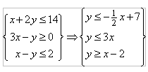
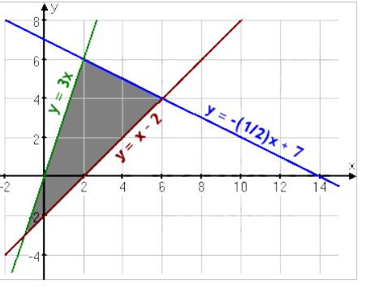
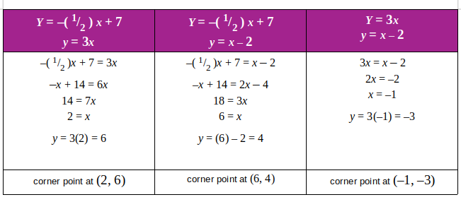

# Optimization-LinearProgramming-Python

<html>
<head><meta charset="utf-8" />

<body>
  

    

<h1 id="&gt;&gt;-Linear-programming:">&gt;&gt; Linear programming:<a class="anchor-link" href="#&gt;&gt;-Linear-programming:">&#182;</a></h1>

One of the Optimization topics is Linear Programming. In this category of optimization problems, both the cost function and all the restrictions are linear.

Linear programming (LP) is one of the simplest ways to perform optimization. We can solve some very complex optimization problems by making a few simplifying assumptions. As an analyst one is bound to come across applications and problems to be solved by Linear Programming.

It is a simple technique where we depict complex relationships through linear functions and then find the optimum points. The real relationships might be much more complex – but we can simplify them to linear relationships.

It could be a breakthrough method while solving optimization problems. One can use it to find Minimum cost expenditure, maximum profit gained, shortest path to travel, etc.

<h1 id="Simple-Example:">Simple Example:<a class="anchor-link" href="#Simple-Example:">&#182;</a></h1><blockquote>
Here I am providing a simple example to illustrate solving a simple LP optimization problem.

<blockquote>
Find the maximal and minimal value of <strong>z = 3x + 4y</strong> subject to the following <strong>constraints</strong>:

<blockquote>
x + 2y &lt;= 14,

3x - y &gt;= 0,

x - y &lt;= 2

</blockquote>

Here we need to find <strong>optimum (Max/Min)</strong> solution for the <strong>Objective Function: z = 3x + 4y</strong>. First of all, we will convert constraints equations into more simpler way:

Now we will plot graph for these constraint equations.

</blockquote>
</blockquote>

<blockquote><blockquote>
The soltuion lies in the bounded (feasible) region. And the optimal solution is  @ either of these corners.

Its tabular repsentation to find the corner points.

</blockquote>
</blockquote>

<blockquote><blockquote><blockquote>
Solution for these corner points:

<blockquote>
(2, 6):      z = 3(2)   + 4(6)   =   6 + 24 =   30

(6, 4):      z = 3(6)   + 4(4)   = 18 + 16 =   34

(–1, –3):  z = 3(–1) + 4(–3) = –3 – 12 = –15

<blockquote>
Then the maximum of <strong>z = 34</strong> occurs at (6, 4),

and the minimum of <strong>z = –15</strong> occurs at (–1, –3).

</blockquote>
</blockquote>
</blockquote>
</blockquote>
</blockquote>

<h1 id="&gt;&gt;-Common-terminologies-used-in-Linear-Programming">&gt;&gt; Common terminologies used in Linear Programming<a class="anchor-link" href="#&gt;&gt;-Common-terminologies-used-in-Linear-Programming">&#182;</a></h1><blockquote>
<strong>Decision Variables</strong>: The decision variables are the variables which will decide my output. They represent my ultimate solution. To solve any problem, we first need to identify the decision variables. For the above example, the total number of units for A and B denoted by X &amp; Y respectively are my decision variables.

<strong>Objective Function</strong>: It is defined as the objective of making decisions. In the above example, the company wishes to increase the total profit represented by Z. So, profit is my objective function.

<strong>Constraints</strong>: The constraints are the restrictions or limitations on the decision variables. They usually limit the value of the decision variables. In the above example, the limit on the availability of resources Milk and Choco are my constraints.

<strong>Non-negativity restriction</strong>: For all linear programs, the decision variables should always take non-negative values. Which means the values for decision variables should be greater than or equal to 0.

</blockquote>

<h1 id="&gt;&gt;-Solving-LP-problems:">&gt;&gt; Solving LP problems:<a class="anchor-link" href="#&gt;&gt;-Solving-LP-problems:">&#182;</a></h1>

<blockquote>
There are many ways to solve a LP problem; like:- solving it throgh converting it to Standard Form, Graphical Method.
Out of which, Graphical Method is most popular method.

Additionally, we have multiple libraries for python that can help us soving a LP problem.
viz.

<blockquote>
1.) scipy.optimize.minimize

2.) scipy.optimize.linprog

3.) PuLP

4.) Analyzing graphs through plotting with Matplotlib

..... And there must be few other methods also.

</blockquote>
</blockquote>

<h1 id="&gt;&gt;-Circumstances-in-which-we-apply-LP-technique-to-solve-our-daily-analytics-operation">&gt;&gt; Circumstances in which we apply LP technique to solve our daily analytics operation<a class="anchor-link" href="#&gt;&gt;-Circumstances-in-which-we-apply-LP-technique-to-solve-our-daily-analytics-operation">&#182;</a></h1>

we use LP technique to solve the optimiziation cases:

<blockquote><blockquote>
When we want to get best outcome (such as <strong>maximum profit</strong> or <strong>lowest cost</strong>) in a mathematical model; considering whose <strong>requirements are represented by "linear relationships" </strong>.

When its <strong>objective function</strong> can be represented through a <strong> <u>linear function </u></strong>.
    and subject to subject to <strong><u>linear equality</u></strong> and <strong><u>linear inequality</u> constraints</strong>.

-&gt;It can be applied in following application indaily analytics operations:

<blockquote><ol>
<li>
Manufacturing industries use linear programming for <u>analyzing their supply chain operations</u>. Their motive is to <strong>maximize efficiency</strong> with <strong>minimum operation cost</strong>.

</li>
<li>
Linear programming is also used in <strong>organized retail</strong> for <u>shelf space optimization</u>. Since the number of products in the market have increased in leaps and bounds, it is important to understand what does the customer want.

</li>
<li>
Optimization is also used for <u>optimizing Delivery Routes</u>. This is an extension of the popular traveling salesman problem.

</li>
<li>Optimizations is also used in <u>Machine Learning</u>. <strong>Supervised Learning</strong> works on the fundamental of linear programming.</li>
<li>There are many more applications of linear programming in <strong>real-world</strong> like applied by <strong>Shareholders, Sports, Stock Markets</strong>, etc.  </li>
</ol>
</blockquote>
</blockquote>
</blockquote>

<h1 id="Question:">Question:<a class="anchor-link" href="#Question:">&#182;</a></h1>

> A car company produces 2 models, model A and model B. Long-term projections indicate an expected demand of at least 100 model A cars and 80 model B cars each day. Because of limitations on production capacity, no more than 200 model A cars and 170 model B cars can be made daily. To satisfy a shipping contract, a total of at least 200 cars much be shipped each day. If each model A car sold results in a $2000 loss, but each model B car produces a $5000 profit, how many of each type should be made daily to maximize net profits?

<blockquote>
car models - <strong>A</strong> &amp; <strong>B</strong>

*demand: A &gt;= 100 ; B &gt;= 80

*produce: A &lt;= 200 ; B &lt;= 170

<blockquote>
So, we can conclude that: <strong>200 &gt;= A &gt;= 100</strong>   and  <strong>170 &gt;= B &gt;= 80</strong>

</blockquote>

*Shipping: A + B &gt;= 200

*objective function: <strong>( z = 5000B - 2000A )</strong>

</blockquote>

<h1 id="visualization-of-the-problem:">visualization of the problem:<a class="anchor-link" href="#visualization-of-the-problem:">&#182;</a></h1><blockquote><h1 id="The-solution-lies-in-the-feasible-region(-green-region)-------">The solution lies in the feasible region( green region) ------<a class="anchor-link" href="#The-solution-lies-in-the-feasible-region(-green-region)-------">&#182;</a></h1>
</blockquote>

In&nbsp;[9]:

    

<pre>import matplotlib.pyplot 
from matplotlib.pyplot import *
import numpy
from numpy import arange

figure()
A = arange(-100, 220, 10)
B = arange(-100, 220, 10)

# constraint equation

B1 = 200.0 - A

xlim = (-100, 220)
ylim= (-100, 220)
hlines(0, -100, 220, color = &#39;k&#39;)
vlines(0, -100, 220, color = &#39;k&#39;)
grid(True)

xlabel(&#39;X-axis&#39;)
ylabel(&#39;Y-axis&#39;)

#Plotting graph

plot(A, B1, color = &#39;b&#39;)
axhline(y = 80, color = &#39;r&#39;)
axhline(y = 170, color = &#39;m&#39;)
axvline(x = 200, color = &#39;b&#39;)
axvline(x = 100, color = &#39;g&#39;)

title(&#39;objective function: z = 5000B - 2000A with following constarints&#39;)
legend([&#39;A+B&gt;=200&#39;,&#39;200&gt;=A&gt;=100&#39;,&#39;170&gt;=B&gt;=80&#39;])

# get the co-ordinates of intersection points by mere visualisation
A = [200.0,100.0, 100.0, 120.0,200.0]
B = [170.0, 170.0, 100.0, 80.0, 80.0]
fill(A,B,&#39;g+&#39;)

show()

#Getting Solution
checker = 0
for i,j in zip(A,B):
print(&#39;\n calculating for point: A = {0:f} and B = {1:f}&#39; .format(i,j))
    print(&#39;solution for z = &#39;, 5000*j-2000*i)
    if(checker &lt;= (5000*j-2000*i)):
       checker = (5000*j-2000*i)
       X,Y = i,j
       
print(&#39;\n the maximum profit z = ${0:f} @ A = {1:f} and B = {2:f}&#39; .format(checker,X,Y))
</pre>

### Output::::::::::::

<h1 id="Solving-using-library-PULP:">Solving using library PULP:<a class="anchor-link" href="#Solving-using-library-PULP:">&#182;</a></h1>

In&nbsp;[6]:

    

<pre>from pulp import *
# declare your variables
A = LpVariable(&quot;A&quot;, 100, 200)   # 100 &lt;= A &lt;= 200
B = LpVariable(&quot;B&quot;, 80, 170) # 80 &lt;= B &lt;= 170
 
# defines the problem: optimization - Maximization
prob = LpProblem(&quot;problem&quot;, LpMaximize)
 
# defines the constraints
prob += A + B &gt;=200 
prob += A&lt;=200
prob += A&gt;=100
prob += B&gt;=80
prob += B&lt;=170
 
# defines the objective function to maximize
prob += 5000*B-2000*A
 
# solve the problem
status = prob.solve()
print(&#39;printing status of the LP problem: &#39;, LpStatus[status])
 
# print the results A = 100, B = 170
print(&#39;Value of model A car: &#39;, value(A))
print(&#39;Value of model B car: &#39;, value(B))
print(&#39;the optimal solution or say maximum profit: $&#39;, value(prob.objective))
</pre>

### Output::::::::::::

<pre>printing status of the LP problem:  Optimal
Value of model A car:  100.0
Value of model B car:  170.0
the optimal solution or say maximum profit: $ 650000.0
</pre>

<h1 id="Solving-using-Scipy-Library:">Solving using Scipy Library:<a class="anchor-link" href="#Solving-using-Scipy-Library:">&#182;</a></h1>

In&nbsp;[11]:

    

<pre>import numpy as np
from scipy.optimize import minimize

#defining our Objective function
def objective(x):
    A = x[0]
    B = x[1]
    #since we are finding Max result using Minimizer. So returned the negative value.
    return -(5000*B-2000*A)

def constraint(x):
    return x[0]+x[1]-200

#boundations

b1 = [100, 200]     #bounds on A: 200 &gt;= A &gt;= 100
b2 = [80, 170]      #bounds on B: 170 &gt;= B &gt;= 80

bnds = (b1,b2)

#defining Inequality type of constraint.
con = {&#39;type&#39;: &#39;ineq&#39;, &#39;fun&#39;: constraint}

# passing any guess value for A and B into minimize fuinction.
Xguess = [100,100]

#Predicting Maximization values for the objective function by seeding guess value Xguess; boundations included..
sol = minimize(objective, Xguess, method = &#39;SLSQP&#39;, options={&#39;disp&#39;:True}, bounds = bnds, constraints = con)

print(&#39;About solution from Optimize.minnimize: \n&#39; ,sol)

#assigning values to desired results.
profit = -sol.fun   #converting back to positive answer
CarA = sol.x[0]     # number of car A models
CarB = sol.x[1]     # number of car B models

###################################################################

print (&#39;\n\n\nPrinting the Results: \n\n\n&#39;)
print(&#39;maximum Profit Gained: $&#39;, profit)
print(&#39;\n Number of Model A Cars: &#39;,CarA)
print(&#39;\n Number of Model B Cars: &#39;,CarB)
</pre>

### Output::::::::::::

<pre>Positive directional derivative for linesearch    (Exit mode 8)
            Current function value: -650000.0
            Iterations: 7
            Function evaluations: 12
            Gradient evaluations: 3
About solution from Optimize.minnimize: 
      fun: -650000.0
     jac: array([ 2000., -5000.])
 message: &#39;Positive directional derivative for linesearch&#39;
    nfev: 12
     nit: 7
    njev: 3
  status: 8
 success: False
       x: array([ 100.,  170.])

Printing the Results: 

maximum Profit Gained: $ 650000.0

 Number of Model A Cars:  100.0

 Number of Model B Cars:  170.0
</pre>

    

  

</body>

 

</html>
